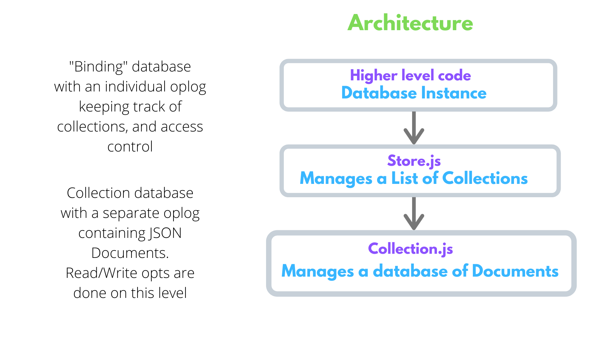

<p align="center">
  <a href="https://dappkit.io" title="AvionDB">
    
  </a>
</p>

<h3 align="center">AvionDB: A Distributed, MongoDB-like Database</h3>

<p align="center">
<a href="https://badge.fury.io/js/aviondb.svg">
</a>
<a href="https://travis-ci.com/dappkit/aviondb"></a>
<a href="https://david-dm.org/dappkit/aviondb"></a>
<a href="https://bundlephobia.com/result?p=aviondb"></a>
<a href="https://discord.gg/88YpNuQ"></a>
</p>

### Architecture



AvionDB uses OrbitDB stores to model MongoDB-like Databases. It creates a notion of:

- Each AvionDB instance can have several [Databases](https://github.com/dappkit/aviondb-specs#databases).
- Each Database can have several [Collections](https://github.com/dappkit/aviondb-specs#collections).
- Each Collection can have several [Documents](https://github.com/dappkit/aviondb-specs#documents).

See more details in the [Specs](https://github.com/dappkit/aviondb-specs).

### Project status & support

Status: **in active development**

***NOTE!*** *AvionDB is **alpha-stage** software. It means AvionDB hasn't been security audited and programming APIs and data formats can still change. We encourage you to [reach out to the maintainers](https://discord.gg/88YpNuQ) if you plan to use AvionDB in mission critical systems.*

This is the Javascript implementation and it works both in **Browsers** and **Node.js** with support for Linux, OS X, and windows . The minimum required version of Node.js is now 8.6.0 due to the usage of `...` spread syntax. LTS versions (even numbered versions 8, 10, etc) are preferred.

## Table of Contents

<!-- toc -->
- [Install](#install)
  - [Using NodeJS](#using-nodejs)
  - [In a web browser](#in-a-web-browser)
	- [In a web browser through Browserify](#through-browserify)
	- [In a web browser through Webpack](#through-webpack)
	- [In a web browser through CDN](#from-cdn)
- [Usage](#usage)
- [API](#api)
- [Development](#development)
  * [Run Tests](#run-tests)
  * [Benchmarks](#benchmarks)
- [Specs](#specs)
- [Community Repos](#community-repos)
- [Frequently Asked Questions](#frequently-asked-questions)
  * [Are there implementations in other languages?](#are-there-implementations-in-other-languages)
  * [Where can I see your Roadmap?](#where-can-i-see-your-roadmap)
  * [What mongodb features does aviondb support?](#what-mongodb-features-does-aviondb-support)
  * [How can I use AvionDB in my Application?](#how-can-i-use-aviondb-in-my-application)
  * [Other questions?](#other-questions)
- [Contributing](#contributing)
- [Sponsors](#sponsors)
- [License](#license)


## Install

This module uses node.js, and can be installed through npm:

### Using NodeJS

```
// Using npm
npm install --save aviondb

// Using Github
npm install git+https://github.com/dappkit/aviondb.git
```

We support both the Current and Active LTS versions of Node.js. Please see [nodejs.org](https://nodejs.org/) for what these currently are. The minimum required version of Node.js is now 8.6.0 due to the usage of `...` spread syntax. LTS versions (even numbered versions 8, 10, etc) are preferred.

### In a web browser

#### **through Browserify**
Same as in Node.js, you just have to [browserify](http://browserify.org/) to bundle the code before serving it.
 > Note: The code uses `es6`, so you have to use [babel](https://babeljs.io/) to convert the code into `es5` before using `browserify`. 

#### **through webpack**
Same as in Node.js, you just have to [webpack](https://webpack.js.org/) to bundle the the code before serving it.
 > Note: The code uses `es6`, so you have to use [babel](https://babeljs.io/) to convert the code into `es5` before using `webpack`.

#### **from CDN**

Instead of a local installation (and browserification) you may request a remote copy of AvionDB from unpkg CDN.

To always request the latest version, use the following:
```html
<!-- loading the minified version -->
<script src="https://unpkg.com/aviondb/dist/aviondb.min.js"></script>
```

CDN-based AvionDB provides the `AvionDB` constructor as a method of the global `window` object. Example:

```javascript
// create an AvionDB instance
const aviondb = await AvionDB.create("DatabaseName", ipfs) 
```

**See [examples/index.html](./examples/index.html) to check out a fully functioning example for AvionDB with browser.**

## Usage


### Example
```javascript
// Import modules
const AvionDB = require("aviondb");
const IPFS = require("ipfs");
const ipfs = new IPFS();
 
const runExample = async () => {
  await ipfs.ready;
    
  // Creates a db named "DatabaseName"
  const aviondb = await AvionDB.init("DatabaseName", ipfs); 
  
  // Returns the List of database names
  await AvionDB.listDatabases()
  // prints ['DatabaseName']

  // Creates a Collection named "employees"
  const collection = await aviondb.initCollection("employees");
 
  // Returns the List of collection names
  await aviondb.listCollections() 
  // prints ['employees'] 
 
  // Adding an employee document
  await collection.insertOne({
    hourly_pay: "$15",
    name: "Elon",
    ssn: "562-48-5384",
    weekly_hours: 100,
  });
 
  // We also support multi-insert using collection.insert()
  // See https://github.com/dappkit/aviondb/blob/master/API.md
    
    
  // Search by a single field Or many!
  var employee = await collection.findOne({
    ssn: "562-48-5384", 
  });
 
  // We also support find(), findById()
  // See https://github.com/dappkit/aviondb/blob/master/API.md
    
  // Returns the matching document
  console.log(employee); 
  // Prints the above added JSON document
    
    
  // Update a document
  var updatedEmployee = await collection.update(
   { ssn: "562-48-5384" },
   { $set: { hourly_pay: '$100' } }
  );
    
  // We also support updateMany(), findOneAndUpdate()
  // See https://github.com/dappkit/aviondb/blob/master/API.md

  // Returns the updated document
  console.log(updatedEmployee); 
  // Prints the updated JSON document

    
  // await collection.close(); // Collection will be closed.
  // await aviondb.drop(); // Drops the database 
  // await aviondb.close(); // Closes all collections and binding database.
  // await ipfs.stop();
};
 
runExample();
```


## API
See [API.md](https://github.com/dappkit/aviondb/blob/master/API.md) for the full documentation.

## Development

### Run Tests
```
npm test
```

### Benchmarks

Run Write Benchmark
```
npm run benchmarks:write
```

Run Query Benchmark
```
npm run benchmarks:query
```

Run Update Benchmark
```
npm run benchmarks:update
```

See [benchmarks/](https://github.com/dappkit/aviondb/tree/master/test/benchmarks) for more info on benchmarks.


## Specs

We are working on the initial Specs. See [AvionDB Specs doc](https://github.com/dappkit/aviondb-specs/blob/master/README.md)

## Community Repos

[Movie-Reviews-CRUD-Application](https://github.com/BCDevs/movies-avionDB) -A Kickstarter Application to understand how AvionDB Works by Implementing one.


## Frequently Asked Questions

### Are there implementations in other languages?

We are working to implement AvionDB for following languages:

- NodeJS & Browser JS
- Typescript
- Golang
- Rust

The best place to find out what is out there and what is being actively worked on is likely by asking in the [Discord](https://discord.gg/88YpNuQ). 

If you want or are planning to create an implementation in a language that is not listed here, then feel free to reach us out and discuss about it in the [Discord](https://discord.gg/88YpNuQ).

### Where can I see your Roadmap?

You can find our Roadmap [here](https://github.com/dappkit/aviondb/issues/10). The features in the Roadmap are taken from 2 separate issues([#7](https://github.com/dappkit/aviondb/issues/7), [#8](https://github.com/dappkit/aviondb/issues/8)) which individually maintain a list of feature proposals related to OrbitDB-specific improvements & AvionDB-specific improvements respectively.

The Roadmap is an open discussion, feel free to add your suggestions, comments.

### What mongodb features does aviondb support?

You can find all the supported MongoDB-like features in our [API docs](https://github.com/dappkit/aviondb/blob/master/API.md).

### How can I use AvionDB in my Application?

You can see the following examples to get started with AvionDB:

- [**aviondb-p2p-sync**](https://github.com/dappkit/aviondb-p2p-sync)

  A TodoList example using showing how you can sync/replicate AvionDB data across multiple devices. In this example, we synced a todolist from a desktop browser to a mobile browser using a QR Code. 

  - Check out the app [here](https://bit.ly/aviondb-p2p-sync)
  - Check out the code [here](https://github.com/dappkit/aviondb-p2p-sync)

- [**aviondb-firebase**](https://github.com/dappkit/aviondb-firebase)

  An example using Firebase for AvionDB Access Control. In this example, we used Firebase email/password authentication as an Access Control for AvionDB (a distributed, MongoDB-like database). So, if you would try to write to AvionDB without logging in, the database will not allow you to do so internally.

    - Check out the app [here](https://bit.ly/aviondb-firebase)
    - Check out the code [here](https://github.com/dappkit/aviondb-firebase)

- [**aviondb-onboard**](https://github.com/dappkit/aviondb-onboard)

  An example using Blocknaive's OnBoard.js Auth based Access Controller for AvionDB & OrbitDB. This allows you to integrate [AvionDB](https://github.com/dappkit/aviondb) with [@metamask_io](https://twitter.com/metamask_io), [@TorusLabs](https://twitter.com/TorusLabs), [@authereum](https://twitter.com/authereum), [@dapper_labs](https://twitter.com/dapper_labs), [@coinbase](https://twitter.com/coinbase), [@TrustWalletApp](https://twitter.com/TrustWalletApp), [@Trezor](https://twitter.com/Trezor), [@Ledger](https://twitter.com/Ledger), [@fortmatic](https://twitter.com/fortmatic), [@portis_io](https://twitter.com/portis_io), [@Squarelink_Inc](https://twitter.com/Squarelink_Inc), [@WalletConnect](https://twitter.com/WalletConnect), [@opera](https://twitter.com/opera), [@ethstatus](https://twitter.com/ethstatus), [@unilogin](https://twitter.com/unilogin), [@imTokenOfficial](https://twitter.com/imTokenOfficial).

    - Check out the app [here](https://bit.ly/aviondb-blocknative)
    - Check out the code [here](https://github.com/dappkit/aviondb-onboard)

- [**aviondb-jwt**](https://github.com/dappkit/aviondb-jwt)

  An example using [JWT](https://jwt.io/) based Access Controller for AvionDB & OrbitDB. You can join the discussion [here](https://github.com/dappkit/aviondb/issues/16).
  **Coming Soon**

- [**aviondb-webauthn**](https://github.com/dappkit/aviondb-webauthn)

  An example using [WebAuthn](https://webauthn.io/) based Access Controller for AvionDB & OrbitDB. You can join the discussion [here](https://github.com/dappkit/aviondb/issues/18)
  **Coming Soon**


### Other Questions?

If you didn't find the answer to your question(s), feel free to reach us out on [Discord](https://discord.gg/88YpNuQ).


## Contributing

**Take a look at our organization-wide [Contributing Guide](https://github.com/dappkit/aviondb/blob/master/CONTRIBUTING.md).**

As far as code goes, we would be happy to accept PRs! If you want to work on something, it'd be good to talk beforehand to make sure nobody else is working on it. You can reach us [on Discord](https://discord.gg/88YpNuQ), or in the [issues section](https://github.com/dappkit/aviondb/issues).

If you want to code but don't know where to start, check out the issues labelled ["help wanted"](https://github.com/dappkit/aviondb/issues?q=is%3Aopen+is%3Aissue+label%3A%22help+wanted%22+sort%3Areactions-%2B1-desc), ["discussion"](https://github.com/dappkit/aviondb/issues?q=is%3Aopen+is%3Aissue+label%3A%22discussion%22+sort%3Areactions-%2B1-desc).

Please note that we have a [Code of Conduct](CODE_OF_CONDUCT.md), and that all activity in the [@dappkit](https://github.com/dappkit) organization falls under it. Read it when you get the chance, as being part of this community means that you agree to abide by it. Thanks.

## Sponsors

The development of AvionDB has been sponsored by:

* [Dappkit](https://dappkit.io)

If you want to sponsor developers to work on AvionDB, please consider sponsoring using the "Sponsor" button on the top of the [AvionDB Github Page](https://github.com/dappkit/aviondb).

## License
[MIT](https://github.com/dappkit/aviondb/blob/master/LICENSE)
